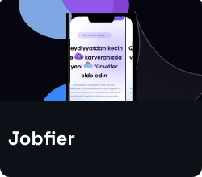

# 🧑🏻‍💻‍️ Debuggers | em1lg

**`Software Developer`**

I am a front-end developer, creating projects in the enchanting world of coding and design. Adapting to the changes in the world of technology and continuously improving myself are essential to me. My goal is to build impressive and user-friendly websites and applications. Creative challenges motivate me, and I am dedicated to constant learning.

---

### 🧰 Languages and Tools

 

---

### 📺 Latest Projects

<!-- BEGIN PROJECT-CARDS -->

<!-- END PROJECT-CARDS -->

#

### 📊 Stats

#

 
<h3>👨‍💻 Emil's Coding Journey</h3>

   I embarked on my coding journey with curiosity and passion for technology. As a front-end developer, I started exploring the magical world of coding and design. Embracing the ever-changing landscape of technology, I made it my mission to keep learning and improving.

Step by step, I honed my skills, creating projects that challenged and excited me. Building user-friendly websites and applications became my focus, and I found joy in crafting impressive user experiences.

Every project presented unique creative challenges, fueling my motivation to learn and grow continuously. The journey of constant learning has become an integral part of my life as a developer.

In this coding journey, I've come to realize that the possibilities are endless, and the learning never stops. With each new challenge, I thrive and embrace the excitement of what lies ahead in the world of coding.

[website]: https://debuggers.az
